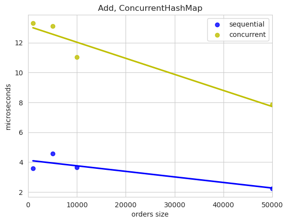

Реализовано два потокобезопасных класса для биржевого стакана. В данных реализациях за основу взяты потокобезопасные структуры данных из библиотеки oneTBB.
Каждый заказ Order кроме полей, описанных в задаче, содержит свой уникальный идентификатор Id. Идентификатор в реальном коде можно присваивать автоматически, инкрементирую счетчик. Идентификатор нужен для упрощения и ускорения работы операций.  

Класс OrderBookTesting использует рандомизированное тестирование. В качестве шаблонного параметра подается имя класса реализации. Замеры времени возвращаются в виде вектора из четырех векторов, где каждый вектор соответствует операции, а элементы  в нем разным размерам данных(1000, 5000, 10000, 50000);  

1) Класс ConcurrentOrderBook_HashSet реализован с использованием tbb::concurrent_hash_map(далее словарь) и tbb::concurrent_set(далее дерево).  В словаре хранится пара идентификатор – указатель на элемент в дереве(необходимо для более быстрого удаления элемента из дерева), в дереве хранятся заказы. Удаление из tbb::concurrent_set является несинхронизированным, поэтому используется shared_mutex для синхронизации доступа. Для заявок покупки и продажи используются отдельные контейнеры. В таком варианте асимптотически операции будут иметь сложность:  
Add – O(logN)  
Remove – O(logN)  
Change – O(logN)  
Top10 – O(1)  

3) Класс ConcurrentOrderBook_HashMap использует  tbb::concurrent_hash_map для обоих типов заявок. Однако итерация по  tbb::concurrent_hash_map является непотокобезопасной и требует дополнительной синхронизации  с shared_mutex. Асимптотики:  
Add – O(1)  
Remove – O(1)  
Change – O(1)  
Top10 – O(N)  

Мысли и другие подходы: в зависимости от стратегии реального использования на практики класса биржевого стакана, описанного в задание, можно модифицировать существующие классы и тестировать много других, которые могут быть оптимальнее в конкретных сценариях. Например, использовать lock-free вектор, неограниченно растущий, в случае, если старые заявки быстро удаляются. Тогда поиск топ10 элементов в данном сценарии, несмотря на теоретическую линейную асимптотику, может быть очень быстрым, так как актуальный стакан будет в виде бегущего окна по массиву, где левый край все время едет быстро вбок. Соответственно в зависимости от сценариев использования можно расширить существенно набор тестов и протестировать совершенно различные реализации с разными контейнерами: вектором, кучей, скип-листом и так далее. А также отдельные контейнеры протестировать в разных реализациях: например lock-free  библиотека folly.  

Ниже представлены графики сравнения для решений в данном репозитории:  

